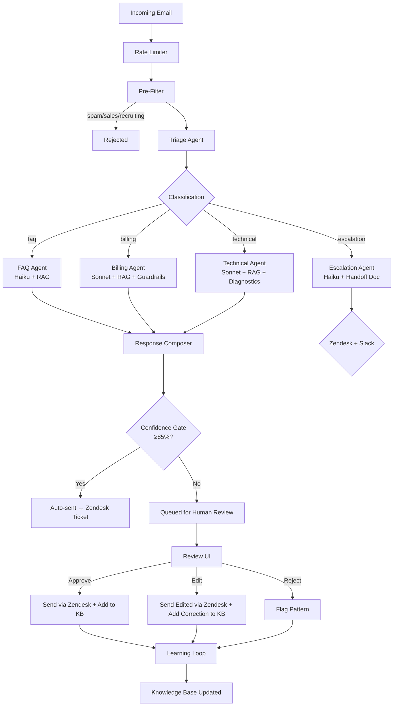

# SupportFlow AI

A multi-agent customer support system built with [Mastra](https://mastra.ai) that classifies incoming emails, routes to specialized AI agents, pulls answers from a knowledge base, and drafts polished responses — with confidence-gated human-in-the-loop review and a learning feedback loop.

**Built as a portfolio project demonstrating AI product management skills:** system design, agent orchestration, human-AI collaboration, cost optimization, and measurable outcomes.

## Architecture



## Agents

| Agent | Model | Role |
|---|---|---|
| **Triage Agent** | Claude Haiku | Classifies intent, urgency, sentiment. Detects multi-intent emails. |
| **FAQ Agent** | Claude Haiku | Answers product/feature questions via RAG over knowledge base. |
| **Billing Agent** | Claude Sonnet | Handles refunds, subscriptions, payments. Enforces $500 refund guardrail. |
| **Technical Agent** | Claude Sonnet | Troubleshooting with structured diagnostic flows from runbooks. |
| **Escalation Agent** | Claude Haiku | Generates structured handoff documents for human agents. |
| **Response Composer** | Claude Haiku | Polishes specialist drafts into on-brand customer-facing emails. |

**Model routing rationale:** Haiku for simple/fast tasks (triage, FAQ, escalation, composing). Sonnet for complex reasoning (billing policy enforcement, technical diagnosis).

## Key Features

- **Confidence Gate** — Responses scoring ≥85% are auto-sent. Below threshold → queued for human review.
- **Human-in-the-Loop Review UI** — Dark-themed dashboard to approve, edit, or reject agent responses.
- **Learning Loop** — Approved responses strengthen the KB. Edited responses add corrections. Rejected responses flag patterns.
- **Knowledge Base (RAG)** — 43 chunks across FAQ, product docs, billing policies, and troubleshooting runbooks. Local embeddings via fastembed.
- **Zendesk Integration** — Every response creates or replies to a ticket. Escalations get priority tagging.
- **Slack Alerts** — Escalations trigger formatted alerts with handoff docs and ticket IDs.
- **Rate Limiting** — Per-customer throttle (10 req/hour) prevents abuse.
- **Pre-Filter** — Catches spam, sales, and recruiting emails before triage.
- **Prompt Versioning** — Every response tagged with a prompt hash for traceability.
- **Eval Suite** — 20 test emails across 4 categories for classification accuracy testing.
- **Customer Context** — Simulated tier + ticket history enrichment for personalized responses.

## Quick Start

### Prerequisites

- Node.js ≥ 22
- Anthropic API key

### Setup

```bash
cd supportflow-ai
npm install

# Configure
cp .env.example .env
# Edit .env and add your ANTHROPIC_API_KEY

# Seed the knowledge base (uses local embeddings, no API key needed)
npm run ingest

# Start the dev server + Mastra Studio
npm run dev
```

### Access

| Service | URL |
|---|---|
| Mastra Studio | http://localhost:4111 |
| Review UI | `npm run review-ui` → http://localhost:3456 |

### Optional Integrations

Set these in `.env` for live mode (omit for demo mode with console logging):

```env
# Zendesk
ZENDESK_DOMAIN=yourcompany.zendesk.com
ZENDESK_EMAIL=agent@yourcompany.com
ZENDESK_API_TOKEN=your-token

# Slack
SLACK_WEBHOOK_URL=https://hooks.slack.com/services/...

# Email (Resend — only needed if sending outside Zendesk)
RESEND_API_KEY=re_...
```

## Scripts

| Command | Description |
|---|---|
| `npm run dev` | Start Mastra dev server + Studio |
| `npm run ingest` | Seed knowledge base with support docs |
| `npm test` | Run unit tests (21 tests) |
| `npm run test:eval` | Run triage eval suite (20 test emails, needs API key) |
| `npm run review-ui` | Serve the Review UI dashboard |
| `npm run typecheck` | TypeScript type checking |

## Project Structure

```
src/
├── mastra/
│   ├── index.ts                    # Mastra instance — registers all agents, tools, workflows
│   ├── memory.ts                   # Shared memory config for thread continuity
│   ├── agents/
│   │   ├── triage.ts               # Email classifier (intent, urgency, sentiment)
│   │   ├── faq.ts                  # Product/feature Q&A with RAG
│   │   ├── billing.ts             # Billing specialist with policy guardrails
│   │   ├── technical.ts           # Technical troubleshooter with diagnostics
│   │   ├── escalation.ts          # Human handoff document generator
│   │   └── response-composer.ts   # Draft → polished email transformer
│   ├── workflows/
│   │   └── support-pipeline.ts    # Full pipeline: filter → triage → route → compose → integrate
│   ├── tools/
│   │   ├── vector-query.ts        # RAG tool — searches KB via fastembed + LibSQL
│   │   ├── ingest-knowledge.ts    # Chunks + embeds markdown docs into vector store
│   │   ├── response-store.ts      # Response storage + confidence gate + review status
│   │   ├── review-api.ts          # Review UI API (dashboard, detail, submit review)
│   │   ├── learning-loop.ts       # Feeds reviewed responses back into KB
│   │   ├── zendesk.ts             # Zendesk API (create/update/search tickets)
│   │   ├── email.ts               # Email sending (Resend) + inbox polling
│   │   ├── slack.ts               # Slack notifications + escalation alerts
│   │   └── rate-limiter.ts        # Per-customer request throttling
│   └── knowledge/                  # KB seed documents (markdown)
│       ├── faq.md
│       ├── product-guide.md
│       ├── billing-policy.md
│       └── troubleshooting.md
├── review-ui/
│   └── index.html                  # Review dashboard (standalone HTML)
└── scripts/
    └── ingest.ts                   # KB ingestion runner

tests/
├── unit/                           # Agent + workflow unit tests (21 tests)
└── eval/                           # Triage classification eval suite (20 test emails)
```

## Design Decisions

| Decision | Rationale |
|---|---|
| **85% confidence threshold** | Balances automation vs. quality. Tunable based on eval data. |
| **Model routing (Haiku vs Sonnet)** | ~70% of tickets are simple FAQ → cheap model. Complex billing/tech → capable model. |
| **Human-in-the-loop as default** | System earns autonomy as confidence improves. Safer rollout. |
| **Learning loop over fine-tuning** | RAG updates are cheaper, faster, and more auditable. |
| **Zendesk as source of truth** | Every interaction = ticket. No replies sent outside Zendesk to avoid duplicates. |
| **Local embeddings (fastembed)** | No OpenAI dependency. Runs offline. One less API key. |
| **Demo mode for integrations** | Zendesk/Slack/Email work without credentials for portfolio demos. |

## Tech Stack

| Component | Technology |
|---|---|
| AI Framework | Mastra |
| Language | TypeScript (strict, ES2022) |
| LLM | Claude Sonnet 4.5 + Haiku 4.5 |
| Embeddings | fastembed (local, no API) |
| Vector Store | LibSQL |
| Memory | @mastra/memory |
| Ticketing | Zendesk API |
| Notifications | Slack Webhooks |
| Testing | Vitest |
| Dev UI | Mastra Studio |
